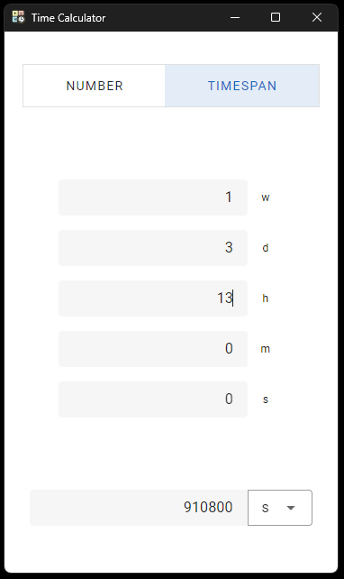

# Time Calculator

The app is made in vue3 + ts + rust tauri.
You can download the `TimeCalculator.exe` directly from this repo.

If you want to customize it but don't have rust, you can work with this repo directly on the web like a normal vue project.
To do that, navigate on the root of the project and `npm install` then `npm run dev`

If you have rust and want to work in tauri, `npm run tauri dev`.
Once you finished and want a sharable .exe, `npm run tauri build`.

The final product will be found in `./src-tauri/target/release/TimeCalculator.exe`

