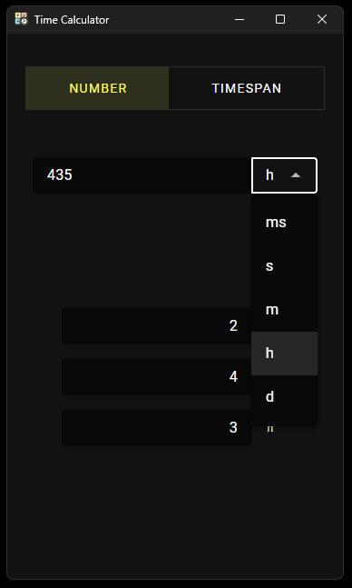

# Time Calculator

The app is made in vue3 + vite + ts + rust tauri2.
You can download the .exe directly from this repo in the same folder `.exe`.

Be sure you have all the [prerequisites](https://v2.tauri.app/start/prerequisites/) tauri requires.

```bash
git clone <this-repo>
```
```bash
cd TimeCalculator
```
```bash
npm install
```
```bash
npm run tauri android init
```

For Desktop Development:
```bash
npm run tauri dev
```

For Android Development:
```bash
npm run tauri android dev
```


The final product will be found in `./src-tauri/target/release/timecalculator.exe`




